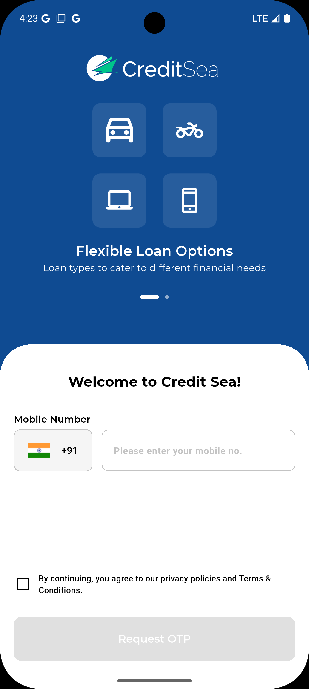
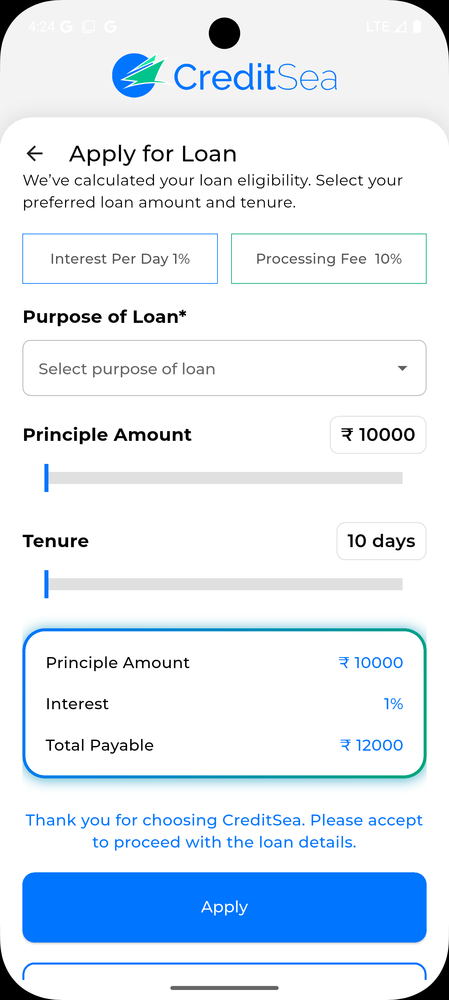
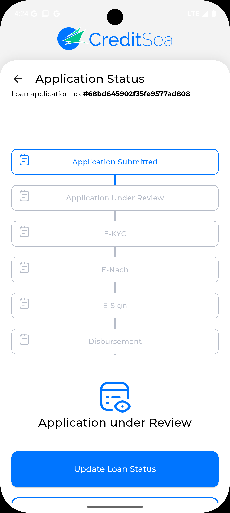

# 💳 Credits Project

A **Flutter-based credit/loan management app** with a **Node.js backend**.  
The app allows users to submit and track loans, while the backend handles authentication, loan storage, and secure APIs.

---

## 🎯 Features Implemented

- User authentication with **JWT**  
- Submit a new loan  
- View all loans  
- View loan details
- View loan status
- Update loan status
- Create User
- get user
- Responsive Flutter UI  
- Input validation  
- Local backend connectivity  

**Bonus Features:**  
- Razor Pay mock payment functionality

 ## 📝 Instructions

### 1️⃣ TO run server from frontend Setup
 - Navigate to the frontend folder:
 - cd frontend
 - flutter pub get
## Update the backend host in frontend/lib/helpers/constants.dart:
 - const String host = "YOUR_LOCAL_IP"; // e.g., 192.168.1.10 or 127.0.0.1(To get your local ip run ipconfig in your terminal or command prompt.)
 - const int port = 8000;
 - String baseUrl = "http://$host:$port";

## 🖼 Screenshots

| Login Screen | Dashboard | Loan Details |
|--------------|-----------|--------------|
|  |  |  |

> Replace the paths with your actual screenshots.

---

## 🛠 Prerequisites

- Node.js (for backend)  
- Flutter SDK (for frontend)  
- MongoDB (local or cloud)  
- Device or emulator for Flutter app  

---

## 🔹 Backend Setup

```bash
cd server
node server.js  # or nodemon server.js

## 🔹 Installing packages on backend
 - npm install express mongoose cors body-parser jsonwebtoken


